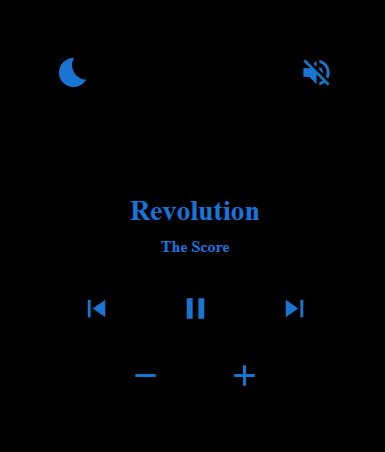

# Local Remote Frontend

This project is the forntend of **_<u>Local Remote Project</u>_**. In this project I've created a Local Remote which can be used to control your media on your windows system. This project uses _React, Typescript, Material UI and Bootstrap_ in the frontend and uses _Flask, WinSDK, Dotenv_ in the backend. The frontend and backend communicated using a proxy setup in your setup. You can Run both of the components in your system locally and access it with your local devices using the local IP of the host system. I've made the default port of frontend as 80 so that need of entering the port with IP is eliminated.

**Note: Feel free to drop suggestions as issues.**

## Project Image

## How to run Backend

Follow these steps to run the backend on your local system:

- Clone the [local-remote-backend](https://github.com/justshivam/local-remote-backend) in your local system.
- Open a terminal in the repo directory.
- Run `python -m venv venv` in the terminal to create a virtual python environment.
- Run `.\venv\Scripts\activate` to activate the virtual the virtual environment.
- Run `pip install -r requirements.txt` to install the required libraries.
- Rename the `.env.example` file as `.env`. (Please avoid changing the PORT in the file)
- Run `python app.py` in your terminal to start the backend server in your local system.

Note: you'll need python properly configured in your system to complete these steps successfully.

## How to run the Frontend

Follow these steps to run the frontend on your local system:

- Clone the [local-remote-frontend](https://github.com/justshivam/local-remote-frontend) in your local system.
- Open a terminal in the repo directory.
- Run `npm install` to install all the required libraries.
- Run `npm start` to run the frontend server on your local system.

Note: you'll need node properly configured in your system to complete these steps successfully.